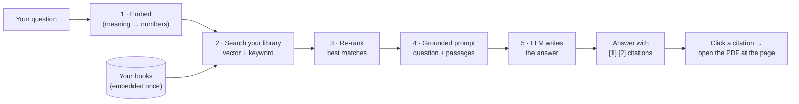

# LibSearch Studio — User Guide

LibSearch Studio lets you **chat with your own ebook library**. You ask a question; it finds
the most relevant passages in *your* books and has a language model answer from them — with
clickable citations that open the source PDF at the exact page.

This guide explains **why** that approach (RAG) gives better answers than a plain chatbot, **how**
it works, and **how to use** the app. The same explanation lives inside the app under
**Settings (gear, lower-left) → Help**.

---

## Why not just ask ChatGPT / a plain LLM?

A large language model (LLM) is excellent at writing and reasoning, but on its own it has three
problems for a personal library:

| Plain LLM | The problem |
|---|---|
| It never read *your* books | It can only draw on its public training data |
| It can **hallucinate** | It will confidently state things that aren't true |
| It gives **no sources** | You can't verify or trace an answer |
| It's frozen at a cutoff date | It doesn't know anything added since |

You could try pasting a book into the chat, but books are far larger than an LLM's context
window — and you'd have to know *which* book and *which* pages first. That "find the right pages,
then answer from them" is exactly what LibSearch automates.

---

## How it works: Retrieval-Augmented Generation (RAG)

Instead of asking the model to answer from memory, LibSearch **retrieves** the relevant passages
from your library first and **augments** the prompt with them. The model then writes its answer
grounded in that evidence.

Step by step:

1. **Embed** — your question is turned into an *embedding*: a list of numbers that captures its
   meaning, so it can be compared to passages by meaning, not just words.
2. **Search your library** — LibSearch runs a **hybrid search**: a *vector* search (closest in
   meaning) fused with a *full-text* search (exact keywords). This catches both "what you meant"
   and "the exact term," which neither alone does well.
3. **Re-rank** — a precise *cross-encoder* reader re-scores the top candidates and keeps only the
   best few, so the model isn't distracted by near-misses.
4. **Grounded prompt** — the app builds a prompt containing your question, the selected passages,
   and an instruction: *answer only from these sources and cite them as `[n]`.*
5. **The LLM** — your chosen model (local **Ollama**, or a cloud provider) writes the answer from
   those passages and returns inline `[n]` citations.

Your books are embedded **once** when you index a folder; after that, every question only embeds
the question and searches the stored vectors — which is fast.

---

## Why the answers are better and more "tuned"

- **Grounded** — answers come from your actual sources, so hallucination is greatly reduced.
- **Verifiable** — every claim links to the page it came from; click `[1]` to read it yourself.
- **Private** — extraction, embedding, search and re-ranking all run **locally** on your machine.
  Only the final wording step goes to the LLM you pick — and if that's local Ollama, *nothing*
  leaves your computer.
- **Yours** — it reasons over *your* library, including books and notes no public model has seen,
  and you can re-index anytime to add new material.

---

## Using the app

### 1. Index your library
Open **Settings** (the gear, lower-left) → **Collections**:
- **Add folder…** to point a collection at one or more folders of PDFs.
- Click **Index / Re-index**. The button uses the **GPU** helper when it's set up (much faster),
  otherwise the built-in **CPU** engine.
- Indexing is **incremental and resumable**: unchanged files are skipped, files that just moved or
  were renamed are recognized by content (not re-embedded), and you can **Stop** and resume later
  — whatever finished is kept.

> **Tip — faster indexing.** Settings → **Indexing** → *Set up GPU indexing (auto)* provisions a
> local helper that embeds on your GPU. First-time indexing of a large library still takes a while
> (it's real work), but it runs in the background, shows elapsed time / throughput / ETA, and is
> resumable.

### 2. Choose how answers are written
Settings → **Synthesis**:
- **Ollama (local)** — no API key, runs on-device, fully private. Install [Ollama](https://ollama.com)
  and pull a model (e.g. `ollama pull llama3.1:8b`).
- **Anthropic / OpenAI / Gemini / Fireworks / Ollama Cloud** — paste an API key. Only the final
  prompt is sent to that provider; keys are stored locally.

You can switch providers quickly from the dropdown in the bar under the chat box.

### 3. Ask
- Pick which **library** to search (left of the bar under the chat box).
- Type your question (**Enter** to send, **⌥Enter** for a new line, **↑/↓** to recall past
  questions).
- Read the answer; click any **`[n]`** citation or a **Sources** entry to open that PDF at the
  cited page in the reader pane.
- **Save as Markdown** exports the answer + its sources as a `.md` file.

### Tuning retrieval
Settings → **Retrieval**:
- **Candidate pool** — how many passages are considered before re-ranking (higher = more thorough,
  slower).
- **Final results** — how many passages reach the model.
- **Min relevance** — drop weak passages; if nothing clears the bar, the app says it can't find an
  answer instead of guessing. Raise it to be stricter.

---

## Frequently asked

**Do my books or questions leave my computer?**
Indexing, search and re-ranking are local. Only the final answer-writing step calls the LLM you
chose — and with local Ollama, nothing leaves your machine.

**Why does a citation say "source not found"?**
The book moved or was renamed since it was indexed. Open **Settings → Collections**, point the
collection at the new location, and re-index — the content dedup means it won't re-embed, just
re-link.

**Why is the first index slow?**
Turning a whole library into embeddings is genuine compute. It's a one-time, resumable, background
job; after that, adding new books is incremental (only the new files are embedded).

**It answered "I couldn't find any matching passages."**
Nothing in the selected library was relevant enough (above *Min relevance*). Try a different
collection, rephrase, or lower the threshold in Settings → Retrieval.
